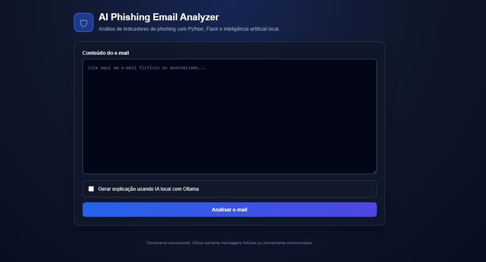
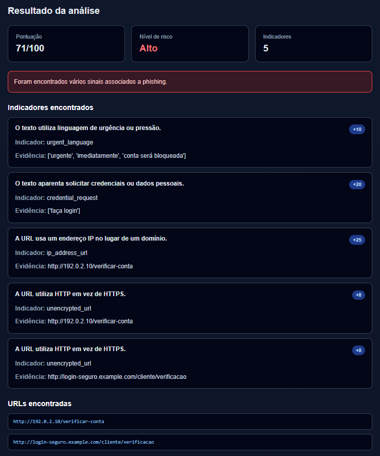
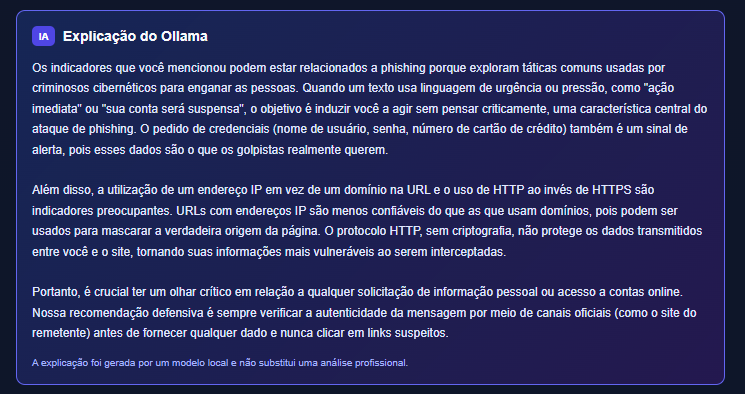

# 🛡 AI Phishing Email Analyzer

An AI-powered phishing email analyzer built with **Python**, **Flask**, and **Ollama**.

The application analyzes suspicious email content, identifies common phishing indicators, calculates a risk score, and optionally generates an AI explanation using a locally running Large Language Model (Gemma 3 via Ollama).

**Live Demo**

👉 https://ai-phishing-email-analyzer.onrender.com/

---

# Preview







---

# Features

- Phishing email analysis
- Risk score (0–100)
- Low / Medium / High classification
- Suspicious keyword detection
- URL extraction
- Suspicious URL analysis
- Explainable detection
- Optional AI explanation using Ollama
- Responsive web interface

---

# Technologies

- Python
- Flask
- HTML5
- CSS3
- Jinja2
- Ollama
- Gemma 3
- Git
- GitHub

---

# How it works

The analyzer combines deterministic security rules with an optional local AI explanation.

```
Email
        │
        ▼
 Flask Web Interface
        │
        ▼
 Risk Engine
        │
 ┌──────┴─────────┐
 │                │
 ▼                ▼
Keyword      URL Analysis
Detection
 │                │
 └──────┬─────────┘
        ▼
 Risk Score
        │
        ▼
 Low / Medium / High
        │
        ▼
(Optional)
Ollama (Gemma 3)
        │
        ▼
AI Explanation
```

---

# Project Structure

```
ai-phishing-email-analyzer
│
├── analyzer
│   ├── __init__.py
│   ├── ai_explainer.py
│   ├── risk_engine.py
│   └── url_analyzer.py
│
├── static
│   └── style.css
│
├── templates
│   └── index.html
│
├── screenshots
│
├── app.py
├── requirements.txt
├── README.md
└── .gitignore
```

---

# Running Locally

Clone the repository

```bash
git clone https://github.com/YOUR_USERNAME/ai-phishing-email-analyzer.git
```

Enter the project

```bash
cd ai-phishing-email-analyzer
```

Create a virtual environment

```bash
python -m venv .venv
```

Windows

```bash
.venv\Scripts\activate
```

Install dependencies

```bash
pip install -r requirements.txt
```

Run the application

```bash
python app.py
```

Open

```
http://127.0.0.1:5000
```

---

# Local AI (Optional)

To enable AI explanations, install Ollama and download the Gemma model.

```bash
ollama pull gemma3:4b
```

The AI runs **entirely on your local machine** and generates human-readable explanations for the detected phishing indicators.

---

# Online Version

The live demo focuses on the phishing detection engine.

The Ollama integration is **disabled in the hosted version**, since it requires a local LLM running on the host machine.

For the full experience (including AI explanations), run the project locally following the instructions above.

---

# Disclaimer

This project is intended for educational and cybersecurity portfolio purposes only.

It analyzes sample or anonymized emails and **does not guarantee** that a message is legitimate or malicious.

Do not paste sensitive or confidential emails into public deployments.

---

# Future Improvements

- Email header analysis
- SPF / DKIM / DMARC verification
- VirusTotal integration
- WHOIS lookup
- Domain age analysis
- Machine Learning classifier
- Attachment analysis
- PDF report export

---

# License

MIT License